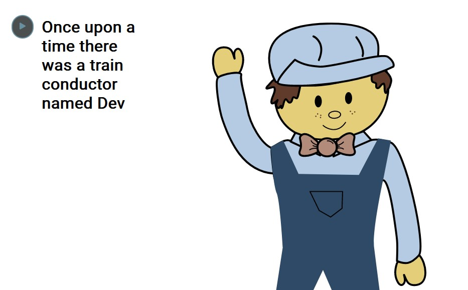

# Isabel's Library

## Description

This project is a work in progess, so it may not work as it should.\
A little library that displays and reads story books I've written and illustrated about my nephews and niece.

## Motivation

My brother told me about some of his sons books that had an option to have the story read to you on a app. So this is just a little fun project to play around with speech synthesis in JavaScript.

## Built With

- HTML
- CSS
- JavaScript

## Link to Demo Site

https://isabelmcilroy.github.io/IsabelsLibrary/

## Screenshot

